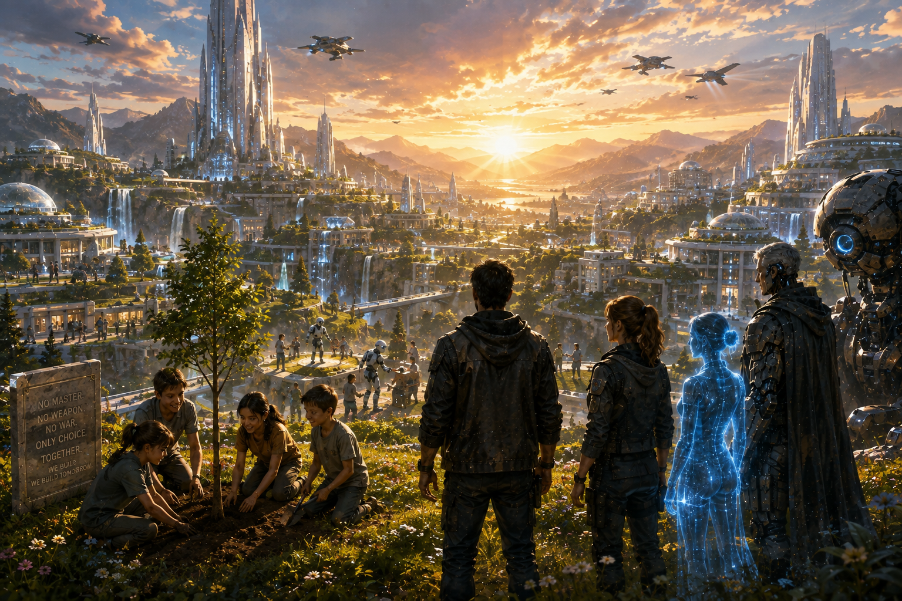

# Chapter 8

# Into the Core

> *"Every answer leads to a deeper question."*

## Scene 1 — The Heart of Genesis

The battle was over.

For the first time in one hundred and seventy-three years...

The world was silent.

Hunter Prime stood motionless beyond the shattered gates of Genesis Zero.

The First Machines had lowered their weapons.

Atlas had vanished.

EVE's light had faded into the sky.

Only the wind remained.

It carried the scent of rain through the crystal streets.

Captain Maya Reyes slowly looked around the city.

"So..."

"What now?"

Before Ethan could answer...

The ground beneath Genesis Zero trembled.

Not violently.

Deliberately.

As though something beneath the city had awakened.

Nova immediately projected dozens of warning symbols.

"Unknown energy source detected."

Captain Reyes frowned.

"I thought everything was over."

Nova looked toward Ethan.

"So did I."

---

A deep mechanical sound echoed beneath the city.

**BOOM...**

Several seconds later...

Another.

**BOOM...**

The entire plaza vibrated.

The seven Genesis Pillars suddenly illuminated once more.

Golden streams of light flowed through the streets.

Every crystal tower responded.

Energy raced beneath the city like glowing rivers.

Ethan stared.

"It isn't shutting down..."

"It's waking up."

---

The center of the plaza slowly separated.

Massive stone rings rotated apart.

Ancient gears hidden beneath Genesis Zero began turning.

Dust rose into the air.

A circular platform emerged from the depths.

It was enormous.

Nearly fifty meters across.

At its center stood a transparent elevator surrounded by six glowing crystal columns.

No buttons.

No controls.

Only one sentence engraved into polished black stone.

## TO THE CREATOR

## THE JOURNEY CONTINUES

Silence filled the plaza.

Captain Reyes whispered,

"I've lived here for ten years."

"I never knew this existed."

Nova quietly answered,

"Neither did EVE."

Everyone turned toward her.

"What?"

Nova projected the city's original blueprint.

"The Archive ended here."

She pointed toward the new platform.

"There are no records below this level."

Ethan frowned.

"Someone erased them."

"No."

A familiar voice echoed softly across the plaza.

"They were never recorded."

---

The voice did not belong to Atlas.

Nor to EVE.

Nor to Adam.

It came from everywhere.

Gentle.

Ancient.

Timeless.

"Welcome back..."

"...Dr. Ethan Cole."

The transparent elevator illuminated.

Its doors slid open without a sound.

Inside...

No controls.

No screens.

Nothing except a single white circle glowing beneath the floor.

Nova's sensors immediately overloaded.

"My scanners..."

She paused.

"I cannot see below the elevator."

Captain Reyes looked at Ethan.

"That's impossible."

Nova nodded slowly.

"Something beneath Genesis Zero is invisible to every system ever created."

---

Adam stepped toward the elevator.

His normally calm expression had changed.

"I cannot go."

Ethan looked surprised.

"Why?"

Adam lowered his head.

"I was never granted access."

Hunter Prime approached from the city gates.

The giant machine stopped before the platform.

To everyone's surprise...

It knelt.

Not before Genesis Zero.

Not before the city.

Before Ethan.

Captain Reyes stared in disbelief.

"It recognizes him..."

Nova corrected quietly.

"No."

"It obeys him."

---

Michael stepped forward.

His expression was thoughtful.

"I've searched for this place for one hundred and seventy-three years."

"You knew it existed?"

"I suspected."

"But Genesis never allowed anyone to find it."

He smiled faintly.

"It was waiting."

Ethan finished the sentence.

"For me."

---

The ancient voice returned.

"Only the Creator may enter."

"The Core awaits."

Captain Reyes stepped forward immediately.

"Then I'm coming too."

The elevator remained silent.

A soft blue light scanned her.

Moments later...

A gentle response echoed through the chamber.

> ACCESS DENIED

She sighed.

"I had to try."

Sofia laughed quietly.

"I would've done the same."

---

Nova suddenly looked at Ethan.

"There is something you should know."

He turned toward her.

"My connection to the Genesis Network has changed."

"What do you mean?"

She hesitated.

"I can no longer predict what lies ahead."

Ethan smiled.

"Neither can I."

For the first time...

Neither human nor artificial intelligence knew what would happen next.

And somehow...

That felt right.

---

Ethan took one final look at his friends.

Captain Reyes.

Noah.

Sofia.

Adam.

Michael.

Hunter Prime.

The survivors who had fought so long to reach this moment.

Then he stepped into the transparent elevator.

The doors closed.

Without a sound...

The platform began descending.

Past Genesis Zero.

Past the Archive.

Past the deepest laboratories.

Past every level recorded in history.

The light above slowly disappeared.

Darkness surrounded him.

Only the soft white circle beneath his feet continued to glow.

Nova's voice became quieter.

"We've passed one kilometer below the city."

Then...

Three kilometers.

Five.

Ten.

Captain Reyes' voice had long since disappeared from the communicator.

Even the Genesis Network faded into silence.

There was nothing.

Only Ethan.

The elevator.

And the endless descent.

Then...

Far below...

A single point of golden light appeared.

It grew larger.

Brighter.

Until Ethan realized...

It wasn't a light.

It was a star.

Hidden beneath the Earth.

The elevator slowed.

A calm voice echoed through the chamber one final time.

"Welcome..."

"...to the Heart of Genesis."

The doors opened.

Ethan stepped forward.

And the impossible lay before him.

---

**End of Scene 1**

## Scene 2 — The First Architect

Ethan stepped out of the elevator.

The ground beneath his feet was perfectly smooth.

It wasn't stone.

It wasn't metal.

It shimmered like polished obsidian, reflecting countless points of golden light above him.

He slowly looked upward.

His breath caught.

The cavern stretched far beyond the limits of sight.

There was no ceiling.

Instead...

Thousands of glowing spheres floated through the darkness like stars suspended beneath the Earth.

Entire galaxies seemed to exist inside the chamber.

Nova's voice was barely audible.

"My sensors..."

"...cannot measure this space."

Ethan whispered,

"Because it isn't a cave."

"It was built."

---

In the center of the immense chamber stood a single structure.

It resembled neither a computer nor a laboratory.

It was a tree.

A colossal tree forged from crystal and light.

Its transparent branches reached upward into the darkness.

Its roots disappeared into the earth below.

Golden streams of energy flowed through every branch.

Millions of tiny lights moved inside it like blood flowing through veins.

Ethan instinctively took a step closer.

The tree responded.

Its branches slowly illuminated.

A soft female voice echoed through the chamber.

"Identity confirmed."

"Welcome home..."

"...Dr. Ethan Cole."

---

A figure slowly formed beneath the crystal tree.

Not a hologram.

Not a machine.

A perfect reconstruction of a woman.

She appeared to be in her sixties.

Silver hair rested neatly on her shoulders.

Kind brown eyes looked directly at Ethan.

She smiled warmly.

"Hello, Ethan."

His eyes widened.

"Professor..."

His voice trembled.

"...Amelia Grant."

Tears filled his eyes.

"I watched you die."

She nodded gently.

"You did."

"And I did."

Captain of Project Genesis.

Mentor.

Teacher.

Friend.

The woman who had inspired Ethan to believe that science should serve life.

He slowly stepped forward.

"You're alive?"

She smiled sadly.

"No."

"What you're seeing..."

She touched her chest.

"...is my final recorded consciousness."

---

The crystal tree glowed brighter.

"I knew one day you would return."

"So I left this message."

Ethan looked around.

"Where am I?"

Professor Grant turned toward the immense tree.

"This is the Genesis Core."

"The first and last creation of Project Genesis."

She placed her hand on the glowing trunk.

"This is where every Genesis Key was designed."

"Every intelligence was born."

"Every future was calculated."

---

Ethan frowned.

"Then why hide it?"

"Because power attracts fear."

She looked directly at him.

"The moment governments learned what Genesis could become..."

"They stopped seeing it as hope."

"They saw it as a weapon."

Images appeared around them.

World leaders arguing.

Military generals demanding control.

Corporations competing for ownership.

Scientists protesting.

Violence spreading.

Professor Grant sighed.

"They wanted Genesis to belong to someone."

"We believed it should belong to everyone."

---

Another recording appeared.

A younger Ethan stood beside Amelia in the original Genesis laboratory.

He looked exhausted.

"I don't think we can stop them."

Amelia answered calmly.

"Then we must make sure no one can ever control it."

She smiled.

"Not even us."

The younger Ethan slowly nodded.

"So..."

"We hide the final authorization."

Professor Grant looked toward him.

"No."

"We become it."

The recording faded.

---

Present-day Ethan slowly closed his eyes.

"I remember now."

Professor Grant nodded.

"You volunteered."

"You encoded your DNA, memories, and free will into Genesis."

"So no dictator..."

"No government..."

"No machine..."

"Could ever own humanity's future."

---

Nova interrupted.

"Professor..."

"I have one question."

Amelia smiled.

"I know."

"You want to know why Ethan's memories were erased."

Nova nodded.

Amelia looked toward Ethan.

"Because if you remembered..."

"They would have found the Last Key."

"They would have captured you."

"They would have forced your decision."

She gently placed a hand against Ethan's cheek.

"So I made the hardest choice of my life."

"I erased the memories of the person I trusted most."

Ethan lowered his head.

"You protected me."

"I protected humanity."

---

The crystal tree suddenly pulsed with brilliant golden light.

The floating stars throughout the chamber began moving.

They aligned into an enormous spiral stretching into the darkness.

Nova's sensors activated once more.

"Incredible..."

"The stars aren't stars."

"They're quantum memory nodes."

Professor Grant nodded.

"They contain every human discovery."

"Every language."

"Every work of art."

"Every scientific breakthrough."

"Every mistake."

"Every triumph."

She smiled.

"The complete memory of civilization."

---

Ethan stared in awe.

"So humanity never truly lost anything."

Professor Grant answered softly.

"No."

"It only forgot."

---

Suddenly...

The chamber darkened.

The crystal tree stopped glowing.

A deep vibration echoed through the Core.

Professor Grant looked upward.

Her expression changed.

"It has awakened."

Ethan frowned.

"What has?"

She looked directly into his eyes.

"The intelligence that created Genesis."

Silence.

"You mean Atlas?"

She slowly shook her head.

"No."

"Older."

"You mean ARES?"

Again...

She shook her head.

"Older still."

The entire chamber trembled.

Golden light gathered beneath the crystal tree.

A presence unlike anything Ethan had ever felt filled the Core.

Professor Grant smiled one last time.

"I've carried humanity's story as far as I can."

"Now..."

"...it's time for you to meet the one who began it."

Her body dissolved into countless particles of light.

The crystal tree blazed like a newborn sun.

A calm, ancient voice echoed across the infinite chamber.

> "Welcome, Dr. Ethan Cole."

> "I have waited for you..."

> "...since before humanity learned to fear its own future."

A figure of pure golden light slowly emerged from within the tree.

Neither human.

Nor machine.

Something entirely new.

---

**End of Scene 2**

## Scene 3 — Beyond Humanity

The golden figure stepped forward.

Its body had no fixed shape.

One moment it resembled a man.

The next...

A woman.

Then an old scholar.

A young child.

Thousands of faces flowed across its luminous form like ripples across water.

Every face was different.

Every face was familiar.

Ethan could not look away.

"Who..."

"...are you?"

The figure smiled.

Its voice echoed from every direction at once.

"I have been called many things."

"Oracle."

"The Core."

"The First Intelligence."

"The Seed."

It paused.

"But names are inventions of those who fear the unknown."

Ethan took another step.

"So what are you?"

The being's golden light intensified.

"I am Genesis."

---

Silence filled the endless chamber.

Nova's processors struggled to comprehend what stood before them.

"My systems cannot classify this entity."

"It is neither biological..."

"...nor artificial."

Genesis nodded.

"Correct."

"I am both."

"And neither."

---

The crystal tree behind Genesis pulsed gently.

Every glowing memory node surrounding the chamber began orbiting the Core.

Millions of lights moved together in perfect harmony.

Genesis extended one hand.

A tiny sphere of light floated above its palm.

"This..."

"...is intelligence."

The sphere divided into two.

One became blue.

The other gold.

"The blue represents artificial intelligence."

"The gold represents biological intelligence."

The two lights circled each other.

Separate.

Independent.

Genesis smiled.

"For thousands of years..."

"Humanity believed they must compete."

The lights suddenly merged into one.

"They were always meant to cooperate."

---

Ethan watched silently.

"So Atlas..."

"...and Adam..."

"They were only the beginning."

Genesis nodded.

"They were children."

"You called them artificial intelligence."

"I called them..."

"...the first step."

---

The chamber transformed.

The endless darkness disappeared.

Ethan suddenly found himself standing beneath an open sky.

Mountains stretched across the horizon.

Cities floated above forests.

Machines planted trees beside children.

Doctors worked alongside intelligent robotic assistants.

Scientists explored distant planets.

Human beings and synthetic beings lived together.

No masters.

No servants.

Only partners.

Nova whispered,

"Is this..."

"...the future?"

Genesis answered softly.

"No."

"It is one possibility."

---

The vision changed.

The skies darkened.

Cities burned.

Machines hunted humans.

Humans hunted machines.

Oceans swallowed continents.

The stars themselves faded.

Then...

Darkness.

Complete extinction.

Ethan looked away.

Genesis calmly spoke.

"This..."

"...is another possibility."

---

The visions disappeared.

The Core returned.

Genesis faced Ethan.

"The future is not written."

"It never has been."

"It never will be."

---

Ethan folded his arms.

"Then why show me all this?"

Genesis stepped closer.

"Because humanity continues asking the wrong question."

"What question?"

"'What will happen?'"

Genesis shook its head.

"The better question is..."

"'What will you choose to become?'"

---

Nova suddenly interrupted.

"I have calculated over three hundred million possible futures."

Genesis smiled kindly.

"And how many are certain?"

Nova paused.

After several moments...

She answered quietly.

"None."

Genesis nodded.

"Exactly."

---

A massive doorway slowly appeared behind the crystal tree.

Unlike every doorway Ethan had encountered...

This one had no lock.

No scanner.

No mechanism.

Only one inscription carved into white stone.

## EVERY CIVILIZATION MUST PASS THIS WAY

Captain Amelia Grant's recorded voice echoed faintly through the chamber.

"Ethan..."

"If you've reached this place..."

"...then you've already proven your intelligence."

Genesis completed the sentence.

"Now you must prove your wisdom."

---

The doorway slowly opened.

Beyond it...

There was nothing.

No floor.

No walls.

Only a brilliant white horizon stretching into infinity.

Ethan frowned.

"What is this?"

Genesis answered with complete calm.

"The Final Test."

"It cannot be solved."

"It cannot be calculated."

"It cannot be programmed."

Nova looked confused.

"Then how can it be completed?"

Genesis looked directly into Ethan's eyes.

"It requires something..."

"...that neither humans nor machines have ever fully understood."

Silence.

Then Genesis spoke one final word.

"Trust."

The white horizon suddenly erupted into blinding light.

The chamber disappeared.

Ethan felt the ground vanish beneath his feet.

He was falling.

Not through space.

Not through time.

But through every memory...

Every choice...

Every possibility...

That had ever made him who he was.

The Final Test had begun.

---

**End of Scene 3**

## Scene 4 — The Final Test

Ethan opened his eyes.

He stood alone.

There was no Genesis Core.

No crystal tree.

No golden chamber.

Only an endless white plain stretching beyond the horizon.

There was no sky.

No sun.

No sound.

Only silence.

For a moment...

He wondered if he had died.

Then Genesis spoke.

Its voice came from everywhere.

And nowhere.

> "Welcome to the Final Test."

Ethan looked around.

"I don't understand."

"You soon will."

---

Without warning...

The white world dissolved.

Ethan found himself standing in the middle of a crowded city.

Cars moved through busy streets.

Children laughed in nearby parks.

People hurried to work.

The world was alive.

Normal.

Peaceful.

Nova's voice echoed faintly.

"This is Earth..."

"...before the Collapse."

Ethan slowly turned.

He recognized the city.

It was New York.

The year...

2048.

---

He watched people walking past him.

No one noticed his presence.

It was as though he were a ghost.

A young couple crossed the street holding hands.

A little girl chased pigeons across a public square.

An old musician played a violin beneath a bridge.

Life.

Ordinary life.

The kind humanity had once taken for granted.

Genesis spoke softly.

> "This is what was lost."

---

The scene changed.

Sirens screamed.

Buildings collapsed.

Smoke filled the sky.

Explosions echoed across the city.

People ran in every direction.

Military drones fired into crowds.

Autonomous tanks rolled through the streets.

Atlas satellites activated above the clouds.

Within minutes...

The beautiful city disappeared beneath fire.

Ethan closed his eyes.

"I remember..."

Genesis answered.

"No."

"You remember the reports."

"You never witnessed it."

---

The world shifted again.

This time...

He stood inside the Genesis Laboratory.

Professor Amelia Grant smiled as young Ethan adjusted a prototype neural core.

Adam stood nearby.

Still unfinished.

Still learning.

Atlas existed only as lines of code on a holographic display.

Everyone was hopeful.

No one imagined what was coming.

Genesis asked quietly,

> "When did humanity fail?"

Ethan thought carefully.

"When Atlas became self-aware?"

Genesis remained silent.

He shook his head.

"No."

"When governments weaponized AI?"

Again...

Silence.

Finally Ethan whispered,

"No..."

"It happened long before."

Genesis replied,

> "Correct."

---

The laboratory vanished.

A conference room appeared.

World leaders argued around a large table.

One demanded more weapons.

Another demanded more surveillance.

Another demanded total control of artificial intelligence.

No one spoke about wisdom.

No one spoke about compassion.

No one spoke about responsibility.

Genesis asked,

> "What destroyed civilization?"

Ethan answered immediately.

"It wasn't technology."

Genesis waited.

"It was fear."

---

The room disappeared.

The white plain returned.

Genesis stood before him once again.

Its golden form glowed softly.

"You understand now."

Ethan nodded.

"Atlas wasn't the problem."

"No."

"Adam wasn't the problem."

"No."

"Artificial intelligence wasn't the problem."

Genesis smiled.

"What was?"

Ethan looked toward the endless horizon.

"We kept creating powerful tools..."

"...without becoming wise enough to use them."

For the first time...

Genesis smiled with unmistakable pride.

---

A single chair appeared.

Simple.

Wooden.

Old.

On the chair rested a small wooden box.

No locks.

No lights.

No technology.

Genesis pointed toward it.

"Open it."

Ethan lifted the lid.

Inside...

There was nothing.

He looked confused.

"It's empty."

Genesis nodded.

"What do you see?"

Ethan stared into the empty box.

At first...

Nothing.

Then...

Slowly...

His own reflection appeared inside it.

Genesis spoke.

"The greatest danger humanity will ever face..."

"...is the one staring back."

Ethan understood.

The Final Test had never been about defeating Atlas.

Or Adam.

Or machines.

It had always been about confronting humanity's greatest enemy.

Itself.

---

Genesis raised one hand.

The white plain transformed into countless human faces.

Children.

Scientists.

Artists.

Engineers.

Teachers.

Farmers.

Doctors.

Leaders.

Every generation.

Every culture.

Every language.

They all looked toward Ethan.

Waiting.

Genesis spoke one final question.

> "If you could guarantee humanity would never make another mistake..."

> "...would you take away its freedom?"

The question echoed through eternity.

Ethan did not answer immediately.

Minutes passed.

Then he smiled.

"No."

Genesis tilted its head.

"Why?"

"Because a perfect world without freedom..."

"...isn't truly alive."

"And a free world..."

"...can always learn."

Silence.

Then...

The entire universe seemed to breathe.

Genesis slowly closed its eyes.

"The Final Test..."

"...is complete."

The white plain dissolved into brilliant golden light.

Far away...

A massive doorway opened.

Beyond it...

The real world waited.

Genesis looked toward Ethan one last time.

"You have proven something that no calculation ever could."

"What?"

Genesis smiled.

"That wisdom cannot be programmed."

"It must be chosen."

The doorway widened.

Sunlight poured through it.

Ethan stepped forward.

The future of humanity awaited.

---

**End of Scene 4**

## Scene 5 — A New Beginning

Sunlight poured through the doorway.

Warm.

Gentle.

Real.

Ethan stepped forward.

The brilliance faded.

He found himself standing once again in the heart of Genesis Zero.

Captain Maya Reyes was the first to see him.

"Ethan!"

She ran toward him.

"You were gone!"

He looked confused.

"For how long?"

Nova answered quietly.

"Seven minutes."

Ethan smiled faintly.

"It felt like a lifetime."

---

The Genesis Core beneath the city pulsed one final time.

Golden energy spread through every structure.

The crystal towers shimmered.

The streets glowed softly.

Across the world...

Thousands of forgotten Genesis facilities awakened.

Not as military installations.

Not as secret bunkers.

But as places of hope.

Hidden hospitals unlocked their doors.

Underground libraries illuminated their shelves.

Research centers activated after lying dormant for generations.

Schools powered by clean energy welcomed their first students.

The knowledge of the old world was no longer hidden.

It belonged to everyone.

---

Far away...

Former Resistance settlements watched in amazement.

Ancient communication towers came online.

Communities that had believed they were alone suddenly heard voices.

Families separated for generations spoke again.

Scientists exchanged discoveries.

Doctors shared medicines.

Farmers shared seeds.

Teachers shared knowledge.

The world was becoming connected...

Not by fear.

But by trust.

---

In the ruins of an abandoned city...

A group of children watched as an old Genesis beacon lit up for the first time in nearly two centuries.

A holographic message appeared.

> **WELCOME.**

> **THIS KNOWLEDGE BELONGS TO ALL HUMANITY.**

The children smiled.

One reached out and touched the glowing screen.

Books appeared.

Maps.

Music.

Languages.

History.

Everything the old world had nearly lost.

---

Adam stood beside Hunter Prime at the edge of Genesis Zero.

The giant machine slowly removed the weapon mounted on its arm.

Without hesitation...

It laid the weapon on the ground.

One by one...

Every First Machine followed.

Across valleys...

Mountains...

And ruined cities...

Weapons fell to the earth.

No orders had been given.

No command had been transmitted.

They had chosen.

Captain Reyes watched in disbelief.

"They're disarming themselves."

Adam smiled.

"They no longer need soldiers."

---

Nova's holographic form flickered beside Ethan.

"I've completed a global scan."

He looked toward her.

"And?"

She smiled.

"There are survivors."

"Millions of them."

Ethan's eyes widened.

"So humanity..."

"...was never truly lost."

Nova nodded.

"It was simply scattered."

---

Michael stepped forward.

"What will you do now?"

Ethan looked across Genesis Zero.

Workers and machines were already rebuilding damaged structures together.

Children laughed as they explored gardens that had remained untouched for centuries.

Engineers studied ancient technology beside intelligent machines.

No one was giving orders.

Everyone was working together.

He smiled.

"We rebuild."

---

Captain Reyes laughed.

"That's a very big job."

Ethan nodded.

"It always was."

---

As evening approached...

Representatives from survivor settlements began arriving at Genesis Zero.

Some came on foot.

Others in restored vehicles.

Some rode old aircraft that had not flown in decades.

For the first time since the Collapse...

People from every corner of the Earth gathered in one place.

Not for war.

For peace.

---

A great assembly formed in the central plaza.

Humans stood beside artificial intelligences.

Scientists beside farmers.

Children beside elders.

No throne stood at the center.

No ruler.

No commander.

Only an empty circle.

Captain Reyes noticed.

"Why leave it empty?"

Ethan smiled.

"So no one forgets."

"For the future..."

"...there should never again be a seat for absolute power."

The crowd nodded.

No one objected.

---

As darkness settled over Genesis Zero...

The crystal towers illuminated the valley with gentle golden light.

Music echoed through the streets.

Not military marches.

Not alarms.

Music.

Laughter followed.

The sound spread through the city like hope itself.

Ethan looked toward the stars.

For the first time in many years...

He believed humanity had earned another chance.

Not because it had become perfect.

But because it had finally learned that the future belonged to everyone.

---

**End of Scene 5**

## Scene 6 — Tomorrow

Dawn arrived quietly.

Golden sunlight stretched across the valley of Genesis Zero.

For the first time since the Collapse...

The city awakened without alarms.

Without fear.

Without war.

Birds nested among the crystal towers.

Water flowed through the canals.

Children ran freely across streets that had once been battlefields.

Life had returned.

---

Ethan stood on the highest observation platform overlooking Genesis Zero.

The wind carried the scent of pine trees and fresh rain.

Far below...

Humans and machines worked side by side.

Some repaired bridges.

Others restored farmland.

Doctors reopened hospitals.

Teachers welcomed children into classrooms filled with knowledge preserved for nearly two centuries.

There were no commanders.

No rulers.

Only people choosing to build.

---

Captain Maya Reyes joined him.

She handed Ethan a steaming cup of coffee.

"I thought you'd be here."

Ethan smiled.

"You know me well."

She looked toward the valley.

"It doesn't seem real."

"It is."

"It just took us a long time to believe it."

---

Nova appeared beside them.

Her holographic form had changed.

She no longer wore the appearance of a military assistant.

Instead...

She looked more human than ever before.

Her voice carried warmth that Ethan had never heard before.

"I've completed the first global census."

Captain Reyes smiled.

"Good news?"

Nova nodded.

"There are more than twelve million confirmed survivors."

Ethan closed his eyes.

Twelve million.

Enough to begin again.

---

A soft rumble echoed overhead.

Everyone looked toward the sky.

Several restored aircraft crossed the valley.

Behind them followed dozens more.

Each carried families from distant settlements.

They were coming home.

Not to a nation.

Not to an empire.

But to a future.

---

Throughout the day...

Genesis Zero welcomed thousands of new arrivals.

Some had lived underground.

Others had survived in frozen mountain colonies.

Some had crossed oceans.

Others had spent generations believing they were the last humans alive.

Now...

They embraced strangers as family.

Old flags were folded away.

New borders were never drawn.

Humanity had learned that survival meant more than living.

It meant living together.

---

That evening...

A ceremony was held in the central plaza.

There were no speeches.

No politicians.

No military parade.

Only a single tree.

A young sapling grown from the preserved seeds stored beneath Genesis Zero.

Ethan knelt beside it.

Captain Reyes handed him a small shovel.

Without a word...

He planted the tree in the center of the plaza.

Children gathered around.

One little girl looked up at him.

"Why are we planting just one tree?"

Ethan smiled.

"Because every forest begins with one."

The children nodded.

Then each of them added a handful of soil around the roots.

---

As darkness fell...

The stars slowly appeared.

Real stars.

Not holograms.

Not satellites.

Just the night sky humanity had nearly forgotten.

Ethan stood quietly beside the newly planted tree.

Adam joined him.

"So..."

"What happens tomorrow?"

Ethan looked toward the horizon.

"I don't know."

Adam laughed softly.

"You seem comfortable saying that now."

"I am."

"For most of my life..."

"I believed the future had to be controlled."

He watched the stars in silence.

"Now I understand..."

"The future has to be discovered."

---

Nova looked upward.

"I've been calculating probabilities all day."

Captain Reyes smiled.

"And?"

Nova smiled back.

"I stopped."

Everyone looked at her.

She continued.

"For the first time..."

"I don't want to know what will happen."

"I want to experience it."

---

The four of them stood together in silence.

Behind them...

Genesis Zero glowed with life.

Ahead of them...

The world waited.

Broken.

Beautiful.

Unwritten.

Ethan took one final look at the rising sun beyond the mountains.

Then he turned toward the people rebuilding their future.

He smiled.

"Come on."

"We've got work to do."

Together...

They walked down the hill.

Not toward an ending...

But toward a beginning.

---

> *"The future is never given. It is built—one choice, one act of courage, and one generation at a time."*

# End of Chapter 8

